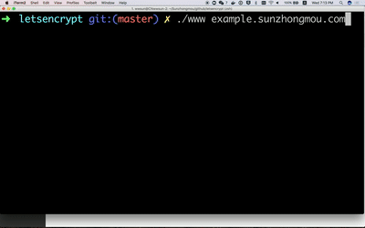

# 

# Let's Encrypt WWW 

[](https://travis-ci.org/sunwei/letsencrypt-www)
[](LICENSE)


For **developer** or **website admin** who need to **manage certificate**, the **Letsencrypt-WWW** is a **command line tool** 
that purely implemented by shell language, unlike other powerful and complex tool, LeWWW provide **lightweight solution**, 
you can easily adjust the source code and fit your requirement, powered by **TDD** and [Let's Encrypt](https://letsencrypt.org/).

---


## Table of Contents
- [Operating System Tested](#-operating-system-tested)
- [Install](#-install)
  - [Prerequisites](#prerequisites)
  - [Installing](#prerequisites)
- [Running The Tests](#-running-the-tests)
- [Usage](#-usage)
  - [Demo](#demo)
- [Features](#-features)
- [Build With](#-build-with)
- [Contributing](#-contributing)
- [License](#-license)


## Operating System Tested

| macOS Sierra | Ubuntu trusty |  
| :---------: | :---------: | 
| Yes | Yes |

## Install

### Prerequisites

* [OpenSSL](https://www.openssl.org/source/)

### Installing

For customize or development:

```console
git clone git@github.com:sunwei/letsencrypt-www.git
cd ./letsencrypt-www

./www --help
```

For tool used locally or in CI/CD. Check releases here: [GitHub letsencrypt-www releases](https://github.com/sunwei/letsencrypt-www/releases)

```console
cd /usr/local/bin
curl -OL  https://github.com/sunwei/letsencrypt-www/archive/v1.0.0.tar.gz
tar -xvzf v1.0.0.tar.gz
mv letsencrypt-www-1.0.0 letsencrypt-www
cd ./letsencrypt-www

./www --help
```

From docker:

```
TODO
```

## Running the tests
```console
make tests
```

## Usage

Take DNSPod provider for example, and issue your domain only three steps:

1. Add your domain to DNSPod, you could do it [here](https://www.dnspod.cn/console/dns)
2. Rename the environment parameters template to **dnspod.env**, and replace the id and token as yours. [How to apply id and token](https://www.dnspod.cn/console/user/security)
```console
cd ./letsencrypt-www
cd ./secrets
mv dnspod.env.example dnspod.env
```
3. Issue your domain, default env is staging
```console
./www --help
./www -p example.letsencryptwww.com
```

### Demo



[YouTube](https://youtu.be/CoFhusw9sqA)

[Youku] Coming soon...

## Features
    
* Challenge types
  * DNS-01 **Supported**
  * HTTP-01 coming soon...
  * TLS-SNI-01 coming...

* Providers
  * DNSPod **Supported**
  * Google coming soon
  * Others...

## Build With
* [Let's Encrypt](https://letsencrypt.org/docs/) as CA
* [git-crypt](https://github.com/AGWA/git-crypt) to encrypt sensitive data
* [Bats](https://github.com/sstephenson/bats) as test framework

## Contributing
Please read [CONTRIBUTING.md](./CONTRIBUTING.md) for details on our code of conduct, and the process for submitting pull requests to us.

## Authors
 


For detail information, please refer to [authors page](https://github.com/sunwei/letsencrypt-www/graphs/contributors)

## License
This project is licensed under the MIT License - see the [LICENSE](./LICENSE) file for details
