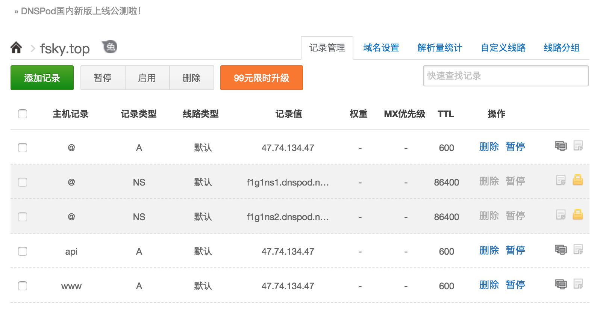
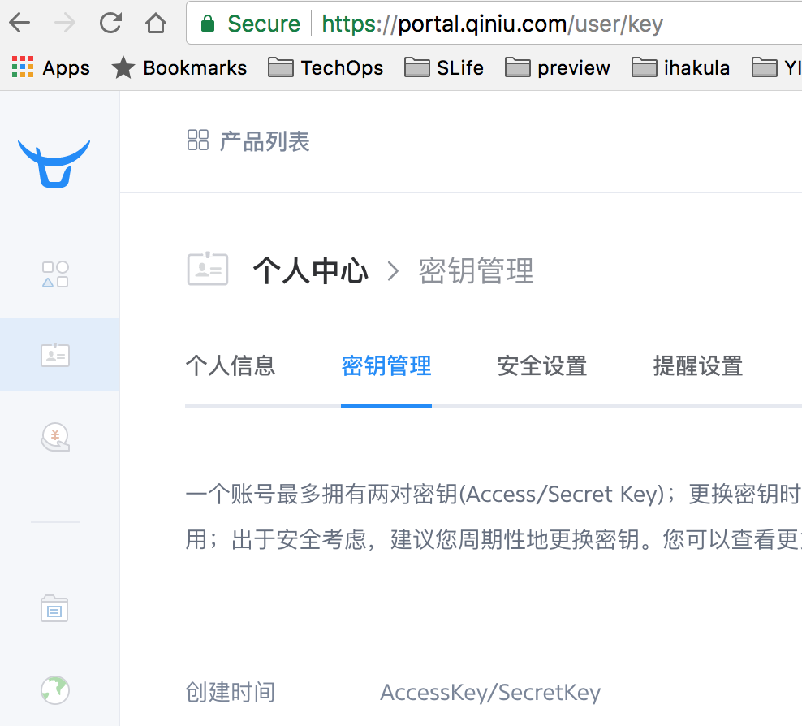

# 使用 letsencrypt-https 为你的域名提供免费SSL/TLS证书 

如何使用：

1. 将自己的根域名添加到[DNSPod](https://www.dnspod.cn)，并将DNS服务器改为DNSPod推荐的。 - 如果你希望提供更多DNS Provider的支持，如阿里云DNS、或者CloudFlare、Godaddy、Google、AWS等，请提PR，或者直接添加码主微信 - wayde191。
2. 注册[七牛云](https://www-source.qiniu.com/) - 并创建自己的存储空间。（如果不想上传，只想将证书保留在本地，也请PR，或者直接微信联系我。）
3. 配置DNSPod, 七牛云相关环境变量 - /docker/env/*.env 。
    1. 获取DNSPod API id和token, [参考链接](https://support.dnspod.cn/Kb/showarticle/tsid/227/)
    2. 获取七牛云相关密钥，[参考链接](https://portal.qiniu.com/user/key)
4. 修改fqdn参数为你的域名，并运行命令 ```make issue```
5. 上七牛云下载证书。

### 操作步骤详细视频：
* [土豆](http://video.tudou.com/v/XMzQ0MTUyMTIyNA==.html) 
* [优酷](http://v.youku.com/v_show/id_XMzQ0MTUyMTIyNA==.html)
* [UC](https://mparticle.uc.cn/video.html?uc_param_str=frdnsnpfvecpntnwprdssskt&wm_id=4c57810f4b7e4158a11e28e99cfd83c5&wm_aid=e4d6de091752404785c223cf262ee593)
 
或者通过云盘下载原视频 - [下载链接](https://pan.baidu.com/s/1q7-fjwa3ToHQo4rdpXHeyg) 密码: ```ybdm```

### 如有任何问题，欢迎通过以下方式联系我

1. 微信ID: wayde191 - 请注明来意，关键词Github
2. Github上提issue或者PR.

微信二维码：


### 相关截图说明：

修改代码示例：


DNSPod配置示例：


七牛云配置示例：



